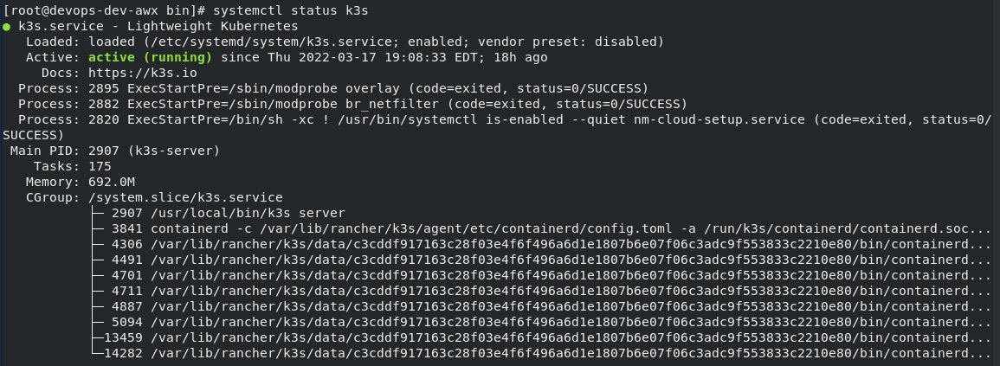
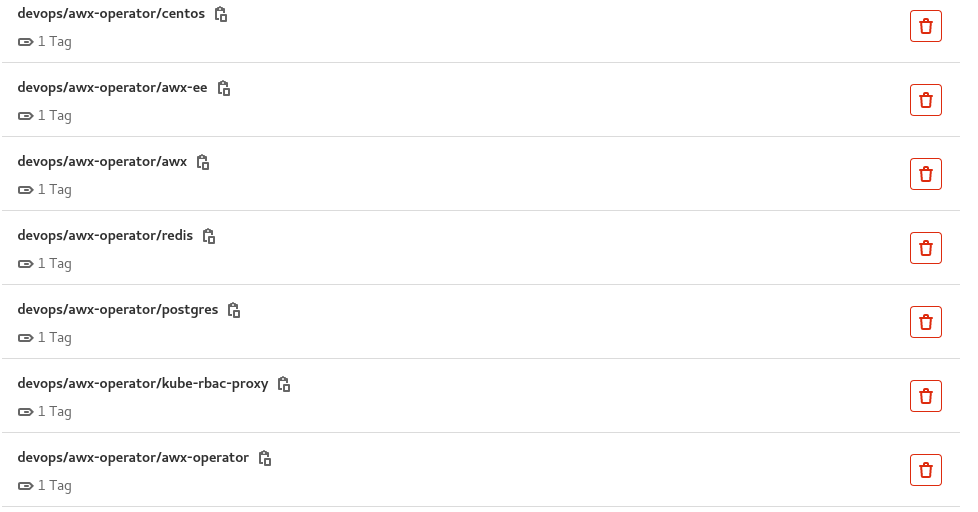
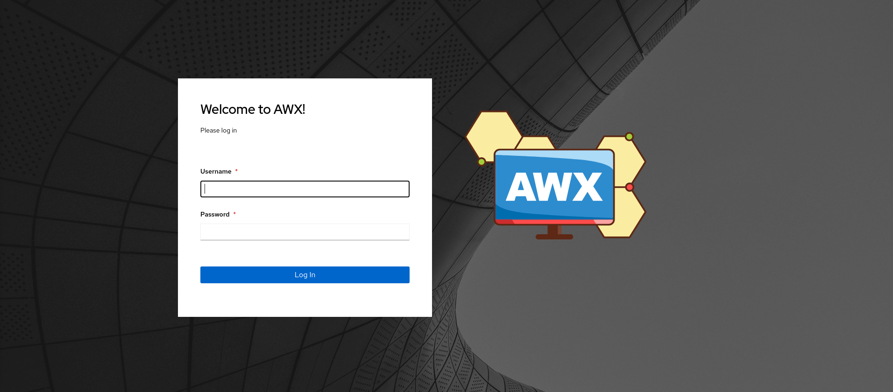

# Airgap-AWX-On-K3s
A complete guide on how to bring up an AWX instance using k3s in an air gapped environment.

## Prerequisites
- Alma Linux VM  
- GitLab Container Registry

## [Air-Gap Install for k3s](https://rancher.com/docs/k3s/latest/en/installation/airgap/) 
1. Download dependencies from https://github.com/k3s-io/k3s/releases and https://github.com/k3s-io/k3s-selinux/releases
* `k3s-airgap-images-amd64.tar`
* `k3s`
* `k3s-selinux-0.4-1.el8.noarch.rpm`

2. Add dependencies to the images directory
```sh
sudo mkdir -p /var/lib/rancher/k3s/agent/images/
sudo cp ./k3s-airgap-images-amd64.tar /var/lib/rancher/k3s/agent/images/
sudo cp ./k3s-selinux-0.4-1.el8.noarch.rpm /var/lib/rancher/k3s/agent/images/
sudo cp ./k3s /usr/local/bin
sudo cp ./install.sh /usr/local/bin
```
3. Ensure that the k3s binary and install script are executable
```sh
cd /usr/local/bin
sudo chmod +x k3s
sudo chmod +x install.sh
ls -l k3s
```

4. Download the k3s install script from https://get.k3s.io and place it in the same folder as the k3s binary
```sh
cp ./install.sh /usr/local/bin
```

5. Run the install script
```sh
INSTALL_K3S_SKIP_DOWNLOAD=true ./install.sh
```

6. Check if k3s is up and running!
```sh
systemctl status k3s
```

NOTE: You may need to include /usr/local/bin in your path to run kubectl commands.
```sh
export PATH=/sbin:/bin:/usr/sbin:/usr/bin:/usr/local/bin
```

<p align="center">
  
</p>

## Deploy awx-operator
1. Clone and copy the awx-operator repository file into your air gapped environment  
https://github.com/ansible/awx-operator

2. Download image dependencies and push to your GitLab container registry
* `awx-operator` (https://quay.io/repository/ansible/awx-operator)
* `kube-rbac-proxy` (https://registry.hub.docker.com/r/rancher/kube-rbac-proxy)

3. Create your new namespace for awx
```sh
kubectl create namespace awx
```

4. Create a secret to pull the dependencies from your GitLab container registry
```sh
sudo kubectl create secret docker-registry awx-puller --docker-server=<my-server-registry> --docker-username=<my-username> --docker-password=<my-password> -n awx
```

5. Edit your /roles/installer/defaults/main.yml file to point your images to your GitLab registry instead of quay.io and docker. Ensure that your image_pull_secret is set to awx-puller. 

6. Run the makefile in the awx-operator repository folder
```sh
make deploy
```

7. Add the imagePullSecrets spec to your deployment yaml and add all image paths to your container registry
```sh
kubectl edit deployment -o yaml -n awx
```
```sh
imagePullSecrets:
  - name: awx-puller
```
<p align="center">
  
</p>

8. Check if your awx operator is up and running!
```sh
kubectl get pods -n awx
```

## Deploy AWX Instance
1. Download image dependencies and push to your GitLab container registry
* `centos 8` (https://quay.io/repository/generic/centos8)
* `awx-ee` (https://quay.io/repository/ansible/awx-ee)
* `postgres 12` (https://hub.docker.com/_/postgres)
* `redis` (https://hub.docker.com/_/redis)
* `awx` (https://quay.io/repository/ansible/awx)

After all dependencies are pushed to your registry, it should look like this:
<p align="center">
  
</p>

2. Create your base directory and copy over the configuration files for your awx instance
```sh
mkdir base
```

3. Apply the base config files to create your awx instance 
```sh
kubectl apply -f base -n awx
```

3. Check the operator logs and status to see your running awx-instance
```sh
kubectl logs -f deploy/awx-operator-controller-manager -n awx -c awx-manager
kubectl get all -n awx
```

If all goes well, you should see the following output: 
```sh
NAME                                                   READY   STATUS    RESTARTS        AGE
pod/awx-operator-controller-manager-6846c6d685-bsvgl   2/2     Running   0               3d17h
pod/awx-instance-1-postgres-0                          1/1     Running   0               2d19h
pod/awx-instance-1-42sf4sfdb5-sf54d                    4/4     Running   0               2d19h

NAME                                                      TYPE        CLUSTER-IP      EXTERNAL-IP   PORT(S)        AGE
service/awx-operator-controller-manager-metrics-service   ClusterIP   10.43.103.10    <none>        8443/TCP       3d17h
service/awx-instance-1-postgres                           ClusterIP   None            <none>        5432/TCP       2d19h
service/awx-instance-1-service                            NodePort    10.43.159.107   <none>        80:32762/TCP   2d19h

NAME                                              READY   UP-TO-DATE   AVAILABLE   AGE
deployment.apps/awx-operator-controller-manager   1/1     1            1           3d17h
deployment.apps/awx-instance-1                    1/1     1            1           2d19h

NAME                                                         DESIRED   CURRENT   READY   AGE
replicaset.apps/awx-operator-controller-manager-6246c6d285   1         1         1       3d17h
replicaset.apps/awx-instance-1-64d6bc5fb5                    1         1         1       2d19h
```

4. Access your web UI using your VM IP address or URL and your node port! 
```sh
<vm ip/url>:<nodeport>  
```

<p align="center">
  
</p>
